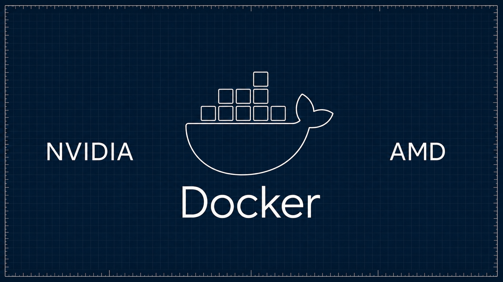

<p align="center">
  <a href="https://lucebox.com"></a>
</p>

<p align="center">
  <a href="https://lucebox.com"></a>
  <a href="https://huggingface.co/Lucebox"></a>
  <a href="https://discord.gg/yHfswqZmJQ"></a>
  <a href="https://lucebox.com/blog"></a>
  <a href="#tutorials"></a>
</p>

<p align="center">
  <a href="LICENSE"></a>
  <a href="https://developer.nvidia.com/cuda-toolkit"></a>
  <a href="https://rocm.docs.amd.com/projects/HIP/en/latest/"></a>
  <a href="https://isocpp.org"></a>
</p>

<p align="center">
  <strong>Speculative inference for single GPUs and heterogeneous machines.</strong><br/>
  Run the target, drafter, experts, and KV cache where each fits best: NVIDIA, AMD, Strix Halo, CPU, or system memory.
</p>

---

## Inference Engine Optimizations

Each path addresses a different bottleneck. The links include setup, limits, and measurements.

| Optimization | Best for | What it does |
|---|---|---|
| [DFlash, DFlash2, and DSpark](server/) | Decode | A model-specific drafter proposes several tokens and the target verifies them together. |
| [PFlash](optimizations/pflash/) | Long prompt prefill | A small drafter selects prompt blocks before the target processes them. |
| [Luce Spark](optimizations/spark/) | Mixture-of-experts models | Keeps hot experts on the GPU and moves cold experts through bounded host-memory storage. |
| [KVFlash](optimizations/kvflash/) | Long-context decode | Keeps a bounded KV working set on the GPU and recalls cold chunks from system memory. |
| [Heterogeneous and multi-GPU execution](server/docs/MIXED_BACKEND.md) | Machines with more than one accelerator | Places targets, drafters, or experts across CUDA and HIP devices; also supports NVIDIA tensor parallelism. |
| [Paged attention](optimizations/paged_attention/) | Concurrent serving | Shares a block-based KV pool across active requests. |
| [Megakernel](optimizations/megakernel/) | Qwen 3.5 0.8B | Fuses 24 layers into one persistent CUDA dispatch. |

---

## Supported Models and Drafters

The results below focus on Qwen 3.8 and DeepSeek V4. Qwen 3.5 and 3.6 remain supported, but their older measurements stay in the component docs instead of being presented as current results.

| Target | Acceleration paths | Drafter or helper |
|---|---|---|
| [**Qwen 3.8 27B**](https://huggingface.co/unsloth/Qwen3.8-27B-GGUF) | DFlash2, CUDA tensor parallelism | [Qwen3.8 27B DFlash2](https://huggingface.co/incoai/Qwen3.8-27B-DFlash2) |
| [**DeepSeek V4 Flash ROCmFPX**](https://huggingface.co/Lucebox/DeepSeek-V4-Flash-0731-ROCmFP3) | DSpark, single-device HIP, heterogeneous expert parallelism | [DeepSeek V4 Flash DSpark](https://huggingface.co/Lucebox/DeepSeek-V4-Flash-0731-DSpark-GGUF) |
| **Laguna XS 2.1 33B** | DFlash, PFlash, Spark, KVFlash | [Laguna DFlash](https://huggingface.co/Lucebox/Laguna-XS-2.1-DFlash-GGUF) and [Qwen3 0.6B](https://huggingface.co/Qwen/Qwen3-0.6B) for prefill |
| **Gemma 4 26B-A4B and 31B IT** | DFlash, KVFlash | [26B drafter](https://huggingface.co/Lucebox/gemma-4-26B-A4B-it-DFlash-GGUF) and [31B drafter](https://huggingface.co/Lucebox/gemma-4-31B-it-DFlash-GGUF) |

## Tested Machines (GPU/APU)

The engine is not tied to one reference card. NVIDIA architectures are selected by CMake; HIP builds should target the device's exact `gfx` architecture.

| | Architecture | Hardware | Runtime | Evidence |
|:---:|---|---|---|---|
|  | RDNA4 `gfx1201` | Radeon AI PRO R9700 | ROCm 6.4+ | [Qwen 3.8 and DFlash2](server/README.md#amd-hip-backend-strix-halo-rx-7900-xtx) |
|  | RDNA3.5 `gfx1151` | Ryzen AI MAX+ 395 / Strix Halo | ROCm 6+ | [DeepSeek V4 and DSpark](server/docs/DS4.md#monolithic-hip) |
|  | RDNA3 `gfx1100` | Radeon RX 7900 XT / XTX | ROCm 6+ | [Dual AMD qualification](server/docs/DS4.md#radeon-rx-7900-xt--strix-halo-true-top-k-6) |
|  | Ampere `sm_86` | RTX 3090, A-series | CUDA 12.0 | [DFlash](server/RESULTS.md) and [Megakernel](optimizations/megakernel/RESULTS.md#rtx-3090-pp520-tg128) |
|  | Blackwell `sm_120` | RTX 5090 | CUDA 12.8 | [DFlash](server/RESULTS.md#rtx-5090-blackwell-sm_120sm_120a-32-gb) |
|  | Blackwell `sm_121` | DGX Spark / GB10 | CUDA 12.9 | [Megakernel NVFP4](optimizations/megakernel/RESULTS.md#nvidia-dgx-spark-gb10-sm_121a) |
|  | Ada `sm_89` | RTX 40xx | CUDA 12.0 | [Linux](server/RESULTS.md#rtx-4090-ada-sm_89-24-gb--cachyos-bare-metal-community) and [WSL2](server/RESULTS.md#rtx-4090-ada-sm_89-24-gb--wsl2-community) community runs |
|  | Turing `sm_75` | RTX 2080 Ti | CUDA 12.0 | [DFlash](server/RESULTS.md#rtx-2080-ti-turing-sm_75-22-gb) |
|  | Volta `sm_70`, Pascal `sm_61` | V100, P40 | CUDA 12.0 | Fallback paths |
| Not pictured | Blackwell `sm_110` | Jetson AGX Thor | CUDA 13.0 | Builds, not benchmarked |

### Single-device results

| Hardware | Model and path | Measured result | Notes |
|---|---|---|---|
| **R9700** | Qwen 3.8 27B + DFlash2 | **204.1 tok/s** HumanEval average, with requests above 230 tok/s | Block size 16 for code and math. Greedy output stayed byte-identical across the tested widths. [Details](server/README.md#amd-hip-backend-strix-halo-rx-7900-xtx) |
| **Strix Halo** | DeepSeek V4 + DSpark | **28.26 tok/s** at the model-default top-6; **32.12 tok/s** at top-4 on the uniform artifact | Top-4 is an explicit approximation and is not suitable for the adaptive artifact. [Details](server/docs/DS4.md#monolithic-hip) |
| **RTX 5090** | Qwen 3.8 27B | **110.6 tok/s** for a 26,758-token prompt and 1,024-token continuation | Prefix-cache miss, full continuation, no CUDA or server errors. [Merged validation](https://github.com/Luce-Org/lucebox/pull/637) |

### Heterogeneous and parallel results

| Hardware | Placement | Measured result | Status |
|---|---|---|---|
| **2x RTX 3090 + NVLink** | Qwen 3.8 target tensor parallel + DFlash2 | **79.7 tok/s**, **2.16x** autoregressive decode | [Merged validation](https://github.com/Luce-Org/lucebox/pull/637) |
| **RX 7900 XT + Strix Halo** | DeepSeek V4 exact top-6 experts + fixed DSpark q=4 | **45.0 to 47.7 tok/s** decode; **111.2 tok/s** prefill at 132,981 tokens | [Qualified profile](https://github.com/Luce-Org/lucebox/pull/604) |
| **R9700 + Strix Halo** | DeepSeek V4 in-process expert parallelism | **51.1 tok/s** decode; **415.52 tok/s** sparse prefill | Opt-in burn-in. The measured top-4 and sparse-prefill settings are approximate. [Qualification](https://github.com/Luce-Org/lucebox/pull/505) |
| **RTX 3090 + Strix Halo** | DeepSeek V4 CUDA + HIP expert parallelism | **48.059 tok/s** median | Opt-in burn-in with top-4 routing. Exact-mode output identity was also validated. [Qualification](https://github.com/Luce-Org/lucebox/pull/570) |

These runs use different prompts, quantizations, and inference policies. They show which configurations work; they are not a cross-hardware ranking.

## Recommended Setups

Use this table to choose a profile. The linked guides contain the complete build flags, model paths, and qualification notes.

| Goal | Hardware and model | Starting configuration |
|---|---|---|
| Qwen on one AMD GPU | R9700 + Qwen 3.8 27B | `--target-device hip:0 --draft-device hip:0 --draft-block-size 16` for code and math; use block size 8 for prose. [HIP guide](server/README.md#amd-hip-backend-strix-halo-rx-7900-xtx) |
| Qwen on one NVIDIA GPU | RTX 30/40/50 + Qwen 3.8 27B | `--target-device cuda:0 --draft-device cuda:0`; start with the [source quick start](#run-the-server). |
| DeepSeek on one APU | Strix Halo + DeepSeek V4 | `--target-device hip:0 --ds4-fused-decode`; keep the model-default top-6 on adaptive artifacts. [DS4 guide](server/docs/DS4.md#monolithic-hip) |
| Qwen on two NVIDIA GPUs | 2x RTX 3090 + Qwen 3.8 27B | `--target-devices cuda:0,cuda:1 --target-split-mode tensor --peer-access` with DFlash2. [Multi-GPU guide](server/docs/MIXED_BACKEND.md) |
| Exact heterogeneous AMD | RX 7900 XT + Strix Halo + DeepSeek V4 | Use the qualified true top-6 profile in [`serve_ds4_dual_rocm_128k.sh`](server/scripts/serve_ds4_dual_rocm_128k.sh). |
| Lucebox heterogeneous profile | R9700 + Strix Halo + DeepSeek V4 | Use the opt-in in-process expert-parallel profile. Top-4 routing and sparse prefill remain explicit approximations. [DS4 guide](server/docs/DS4.md#in-process-heterogeneous-expert-parallel) |

## Client Harnesses

[`harness/`](harness/) runs Lucebox through popular coding clients and checks server compatibility.

<table>
<tr>
<td width="50%" valign="middle">

<a href="harness/"></a>

</td>
<td width="50%" valign="middle">

| Client | Launcher |
|--------|----------|
| Claude Code | [`run_claude_code.sh`](harness/clients/run_claude_code.sh) |
| Codex | [`run_codex.sh`](harness/clients/run_codex.sh) |
| OpenCode | [`run_opencode.sh`](harness/clients/run_opencode.sh) |
| Hermes | [`run_hermes.sh`](harness/clients/run_hermes.sh) |
| Pi | [`run_pi.sh`](harness/clients/run_pi.sh) |
| OpenClaw | [`run_openclaw.sh`](harness/clients/run_openclaw.sh) |
| Open WebUI | [`run_openwebui.sh`](harness/clients/run_openwebui.sh) |

</td>
</tr>
</table>

Set the server binary and model paths, then run a launcher:

```bash
DFLASH_SERVER_BIN=server/build/dflash_server \
DFLASH_TARGET=server/models/Qwen3.8-27B-UD-IQ4_XS.gguf \
DFLASH_DRAFT=server/models/draft/qwen38-dflash2-q8_0.gguf \
MAX_CTX=32768 \
harness/clients/run_codex.sh
```

See the [harness guide](harness/README.md) for setup, no-draft targets, and benchmarks.

## Quick Start With Docker

Prebuilt images on GHCR track `main`. Mount the weights and serve the OpenAI-compatible API on `:8000`.

<table>
<tr>
<td width="38%" valign="middle">

| GPU | Image tag |
|-----|-----------|
| NVIDIA (CUDA 12+) | `:cuda12` |
| AMD (ROCm 6+) | `:rocm` |

Download the target and drafter from the [source quick start](#run-the-server) into `server/models/` first.

</td>
<td width="62%" valign="middle">

<a href="https://lucebox.com/blog/docker"></a>

</td>
</tr>
</table>

Run the image for your GPU:

```bash
# NVIDIA
docker run --rm --gpus all -p 8000:8080 \
  -v "$PWD/server/models:/opt/lucebox-hub/server/models" \
  ghcr.io/luce-org/lucebox-hub:cuda12

# AMD
docker run --rm --device /dev/kfd --device /dev/dri \
  --group-add video --group-add render --security-opt seccomp=unconfined \
  -p 8000:8080 -v "$PWD/server/models:/opt/lucebox-hub/server/models" \
  ghcr.io/luce-org/lucebox-hub:rocm
```

See the [Docker tutorial](https://lucebox.com/blog/docker) for the full setup.

## Run the Server

This CUDA quick start serves Qwen 3.8 27B with DFlash2 on `:8000`. For HIP and mixed-device builds, use the [server guide](server/README.md).

```bash
# build (CUDA 12+, CMake 3.18+)
git clone --recurse-submodules https://github.com/Luce-Org/lucebox && cd lucebox
cmake -B server/build -S server -DCMAKE_BUILD_TYPE=Release
cmake --build server/build --target dflash_server -j

# default weights (~16 GB)
hf download unsloth/Qwen3.8-27B-GGUF Qwen3.8-27B-UD-IQ4_XS.gguf --local-dir server/models/
hf download incoai/Qwen3.8-27B-DFlash2 --local-dir server/models/dflash2-hf
python server/scripts/convert_dflash_to_gguf.py \
  server/models/dflash2-hf/model.safetensors server/models/draft/qwen38-dflash2-f16.gguf
python server/scripts/quantize_dflash_draft.py \
  server/models/draft/qwen38-dflash2-f16.gguf server/models/draft/qwen38-dflash2-q8_0.gguf --scheme q8_0

# run
./server/build/dflash_server server/models/Qwen3.8-27B-UD-IQ4_XS.gguf \
  --draft server/models/draft/qwen38-dflash2-q8_0.gguf \
  --draft-block-size 16 \
  --max-ctx 131072 \
  --cache-type-k q8_0 --cache-type-v q8_0 \
  --port 8000
```

### Making requests

Use `temperature: 0` for deterministic output and the highest speculative-decoding acceptance:

```bash
curl :8000/v1/chat/completions -H 'Content-Type: application/json' -d '{
  "model": "dflash",
  "messages": [{"role": "user", "content": "Write quicksort in Python."}],
  "temperature": 0
}'
```

## Documentation

| Topic | Guide |
|---|---|
| Build, runtime flags, and per-GPU setup | [Server guide](server/README.md) |
| OpenAI Chat Completions, Responses, and Anthropic Messages | [API reference](server/docs/API.md) |
| CUDA, HIP, and mixed-device placement | [Mixed-backend guide](server/docs/MIXED_BACKEND.md) |
| DeepSeek V4 single-device and heterogeneous profiles | [DeepSeek V4 guide](server/docs/DS4.md) |
| Environment variables | [Environment reference](server/docs/ENVIRONMENT.md) |
| Server internals | [Architecture](server/docs/ARCHITECTURE.md) |
| Client integration and qualification | [Harness guide](harness/README.md) |

Benchmarks stay with each implementation: [DFlash](server/RESULTS.md), [PFlash](optimizations/pflash/), [Spark](optimizations/spark/), [KVFlash](optimizations/kvflash/), and [Megakernel](optimizations/megakernel/).

---

## Tutorials

Video tutorials for each optimization and the harness setup.

|   |   |   |
|:-:|:-:|:-:|
| **Luce Spark**<br>[▶ YouTube](https://www.youtube.com/watch?v=LB1aVj9lNhg) | **Luce DFlash**<br>[▶ YouTube](https://www.youtube.com/watch?v=vbPGvvSB8IQ) | **Luce Turboquant**<br>[▶ YouTube](https://www.youtube.com/watch?v=uTOOrfhrnBk) |
| **Luce Harness setup**<br>[▶ YouTube](https://www.youtube.com/watch?v=PysoxVGfvRE) | **Luce PFlash**<br>[▶ YouTube](https://www.youtube.com/watch?v=NWeKUL9Bc6Y) | **Luce Megakernel**<br>[▶ YouTube](https://www.youtube.com/watch?v=e6jY4goVIu0) |
| **Luce KVFlash**<br>[▶ YouTube](https://www.youtube.com/watch?v=8rTVCRWvRDo) |   |   |

---

## The Lucebox Machine

The open engine also ships on Lucebox hardware. The current machine pairs a 32 GB Radeon AI PRO R9700 with a Ryzen AI MAX+ 395 and 128 GB of unified memory. The R9700 is our current Qwen 3.8 single-card target. Strix Halo runs DeepSeek V4 by itself and can also own routed experts beside the R9700.

<p align="center">
  <a href="https://lucebox.com"></a>
</p>

See the hardware and current benchmarks at [lucebox.com](https://lucebox.com).

---

## Request for Contributions

We welcome focused contributions to CUDA and HIP kernels, speculative inference, support for more consumer GPUs and APUs, performance benchmarks, and client harnesses.

---

## Citation

```bibtex
@software{lucebox_2026,
  title  = {Lucebox: Speculative inference for heterogeneous consumer hardware},
  author = {Lucebox},
  url    = {https://github.com/Luce-Org/lucebox},
  year   = {2026}
}
```

---

## Community

- **Discord**: [discord.gg/yHfswqZmJQ](https://discord.gg/yHfswqZmJQ)
- **Website**: [lucebox.com](https://lucebox.com)
- **Issues**: [github.com/Luce-Org/lucebox/issues](https://github.com/Luce-Org/lucebox/issues)
- **Blog**: [lucebox.com/blog](https://lucebox.com/blog)

---

<p align="center">
  <sub><a href="LICENSE">Apache 2.0</a> · <a href="https://lucebox.com">Lucebox.com</a></sub>
</p>
