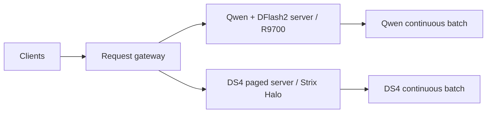

# Heterogeneous request routing: Qwen on R9700 and DS4 on Strix Halo

Status: design proposal for discussion. No request router or collaboration mode
is implemented by this document. The integrated prerequisite tree has not been
built or qualified on GPUs in this task.

## Target and prerequisites

Keep Qwen3.8 27B with DFlash2 resident on R9700 and DeepSeek V4 resident on
Strix Halo alone. Run independent Lucebox server processes and retain each
model's existing continuous batching. A small HTTP gateway routes complete
requests; it never moves a live sequence between models.

This branch incorporates these inspected prerequisite heads:

- [#598](https://github.com/Luce-Org/lucebox/pull/598),
  `a085cc222c513be0dd9d015fe8f7f8a61b6bcc8c`: DS4 paged concurrent serving,
  including monolithic Strix Halo.
- [#707](https://github.com/Luce-Org/lucebox/pull/707),
  `828ecf14a951bcc6ca32dba17da1e958a6e2db8e`: Qwen-family DFlash2
  concurrent verification fusion.

The DS4 dual-GPU expert-placement recipe is a different deployment: it would
compete for the R9700 assigned to Qwen here. Pin both Qwen target and draft to
the R9700 and DS4 entirely to Strix, verifying physical device identities after
process visibility filtering. Qualify simultaneous residency, target plus draft
weights, KV/state capacity at the chosen context, host RAM, and shared host
resource contention before assuming the servers are independent in performance.

## Recommendation

Start with load routing and explicit model selection. Evaluate quality
collaboration in a bounded client harness before adding it to the gateway.

There is no shared cross-model batch, tokenizer, KV cache, or speculative
verification contract. DFlash2 remains Qwen's internal accelerator. Using Qwen
as a DS4 token draft would require a separate compatibility and verification
implementation; it is outside this proposal.

## Load routing at C=4

C means simultaneous user requests. Backend occupancy counts running model
calls. In direct routing, each admitted user request owns one backend call;
quality collaboration can consume two calls for one user request.

Use a four-request global admission limit and configurable backend caps.
A two-slot cap per backend provides the initial 2+2 experiment. It is a ceiling,
not a requirement to wait for a full batch. Compare 4+0, 3+1, 2+2, 1+3, and 0+4
where each backend's measured memory and serving limits permit them.

For an initial implementation:

1. Honor explicit model selection. Automatic routing must be an explicit alias
   that allows model substitution; it cannot silently replace a requested model.
2. Filter by supported request features and context capacity before considering
   load. Tool use, structured output, and multimodal inputs need actual backend
   support. Use each backend's tokenizer for exact context admission.
3. Among eligible healthy backends with capacity, minimize outstanding calls
   divided by configured capacity. Reserve capacity atomically before dispatch.
   Use a deterministic tie break. Treat this as an occupancy baseline, not an
   estimate of finish time.
4. If no eligible capacity is free, use a bounded FIFO queue with a deadline.
   Select the backend when dispatching; avoid hiding a second unbounded queue
   inside either model server. Skip blocked entries only with bounded fairness.
5. Keep the reservation until the upstream request finishes or cancellation
   is acknowledged. A client disconnect is not proof that GPU work has stopped.
   Release exactly once on every terminal path; reconcile failed backend state
   before admitting replacements.

The gateway must be the sole inference ingress for its occupancy count to be
meaningful. Otherwise use authoritative server admission/load telemetry.
`/health` currently returns liveness only. It does not expose queue pressure or
available cache capacity; a healthy backend can still reject admission.

After collecting representative request timings, compare calibrated predicted
completion time against normalized occupancy. Condition estimates on backend,
prompt length, output budget, active prefills/decoders, and usable prefix-cache
hits. Queue delay, prefill, and decode all matter; active request count alone
misses a long prefill. Do not add a learned predictor before this baseline is
measured. Unknown output length is an estimate with a bounded requested budget.

Two plus two is not automatically optimal. A long DS4 request can dominate a
four-request wave even while Qwen becomes idle. Batched token throughput does
not directly predict request completion latency. Cross-model token totals also
use different tokenizers, so compare completed tasks and latency alongside
per-model tokens rather than optimizing their sum alone.

## Quality at C=1

DS4 as the quality specialist is a hypothesis for these exact checkpoints,
quantizations, and tasks. Measure it against Qwen before encoding that ranking.

| Strategy | Model work per user request | Candidate benefit | Main tradeoff |
| --- | --- | --- | --- |
| Select one model | One call | Send suitable tasks to the better model | Cannot exploit both models on one task |
| Qwen candidate, DS4 review/revision | Two sequential calls | DS4 can find or fix specific defects | Added latency and anchoring on Qwen errors |
| Independent Qwen and DS4 answers, then DS4 synthesis | Two parallel calls, then another DS4 call | Diverse candidates before reconciliation | Extra DS4 work and synthesis may select an incorrect answer |
| DS4 plan, Qwen implementation, external checks | At least two calls plus checks | Divide reasoning and execution work | Requires an application workflow and useful task decomposition |

First quality experiment: Qwen generates a bounded candidate; a harness runs
available deterministic checks; DS4 receives the original request, candidate,
and check results and returns the final answer. Treat candidate text as untrusted
quoted data. Prefer unit tests, schema checks, or grounded evidence over asking
a model to assign its own confidence. Blind review or an independent DS4 answer
is a useful control for anchoring.

For open-ended tasks without checkable answers, compare independent candidates
plus synthesis against DS4 alone and DS4 with the same total generation/time
budget. The latter distinguishes model complementarity from simply spending
more inference compute. Do not infer correctness from agreement or a model's
confidence score.

Only the final selected answer is user-visible. Do not stream a provisional
answer and then replace it. Report time to first final-answer token as well as
total latency. Intermediate tool calls must never be executed twice: an initial
collaboration experiment should use text-only tasks or let the harness execute
explicitly permitted checks once. Preserve the original conversation for each
model and retokenize it; no cross-model cache transfer is assumed.

At higher load, optional collaboration needs its own compute budget. Already
admitted work is not preempted; new optional review passes should yield to
waiting direct requests. An explicitly requested quality mode must queue or
return a clear capacity error if it cannot meet its contract, rather than
silently downgrade to a single-model answer.

## Ownership and first implementation boundary

The existing `HttpServer::scheduler_loop(SeqEngine &)` owns each server's
admission, streaming, and retirement. Concrete sequence engines own KV pages,
recurrent state, and batched execution. Preserve that boundary.

A gateway would own only backend configuration/capabilities, admission
reservations, the bounded waiting queue, upstream connections, and request
routing. Start with OpenAI-compatible chat completions and two fixed upstreams.
Protocol adapters in `harness/clients/` demonstrate HTTP forwarding but also
rewrite requests for benchmarks; they are not a transparent production router.

Direct routing must preserve messages, sampling options, tools, stream chunks,
usage, finish reasons, and selected model provenance. Support bounded stream
buffers and propagate disconnects/timeouts. Retry only where no response has
been exposed and the prior call is known to have stopped, honoring explicit
model selection. Tool effects need an application-level idempotency contract.
Keep conversation affinity explicit where model continuity or cache reuse is
needed; do not infer sessions from IP addresses or identical prompts.

Do not change `SeqEngine` or add shared GPU state for this feature. A separate
process is the proposed initial owner; in-process deployment can be reconsidered
only if a measured deployment requirement justifies it.

## Qualification before runtime promotion

- Record exact source, binary, model/draft/quantization identities, device
  placement, context and batching settings. Run both servers together to detect
  memory pressure and host resource interference.
- Use matched mixed-length prompts at C=1 through C=4, with distinct prompts,
  arrival patterns, and bounded outputs. Compare each single-backend baseline,
  fixed splits, then automatic load routing. Include a slow prefill beside
  short decodes; identical replicated prompts alone are insufficient.
- Report completed requests/sec, p50/p95 TTFT and completion latency, per-model
  output throughput, queue time, error/cancellation rates, and task quality.
  Use repeated matched runs and report noise. Set numerical acceptance gates
  from the baseline and intended latency target before the candidate run.
- Check streaming and non-streaming preservation, concurrent admission caps,
  timeout/disconnect retirement, slow readers, full queue, backend failure,
  unsupported features, explicit model routing, and backend restart. Integration
  tests should observe requests and output rather than private helper calls.
- Compare quality variants on held-out tasks against both single models and
  equal-budget single-model controls. Use executable checks where possible;
  otherwise blinded judging with answer-order randomization. Include corrections
  that make a previously correct answer worse.
- Use the current Luce Forge guidance and LuceGraph if profiling becomes
  necessary. No performance or quality improvement is claimed in this proposal.

## Research that motivates experiments

- [RouteLLM](https://arxiv.org/abs/2406.18665) studies selecting between models
  using preference data. It motivates task-sensitive routing, but its published
  cost results do not establish latency or quality for this local model pair.
- [Mixture-of-Agents](https://arxiv.org/abs/2406.04692) evaluates aggregating
  model outputs. It motivates the independent-candidate/synthesis experiment;
  results on its model ensemble are not evidence for this two-device setup.
- [Large Language Models Cannot Self-Correct Reasoning Yet](https://arxiv.org/abs/2310.01798)
  reports limitations of intrinsic reasoning self-correction without external
  feedback in its experiments. It motivates checkable feedback and controls,
  not a universal claim that model review cannot work.

The proposed first runtime PR is load routing only. Decide whether its default
should be normalized occupancy or a calibrated completion-time policy after
measuring the fixed-split baselines. Quality collaboration remains an opt-in
experiment until it beats the relevant single-model control.
